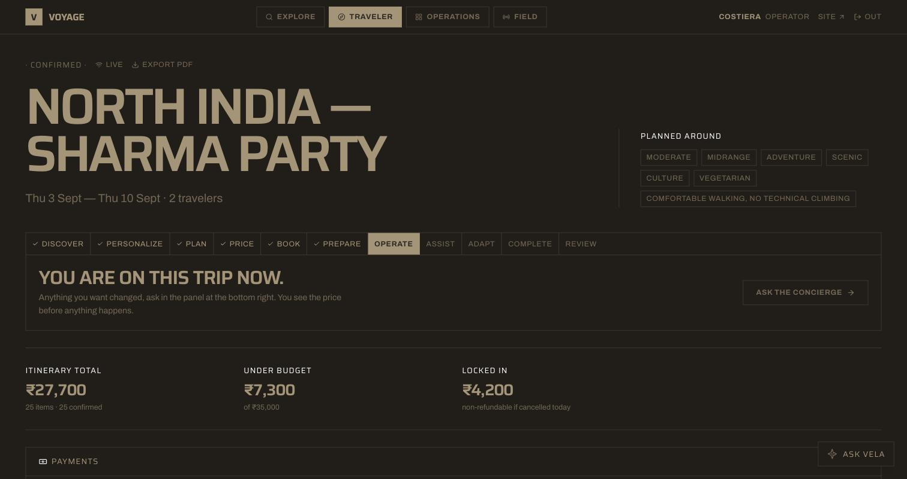
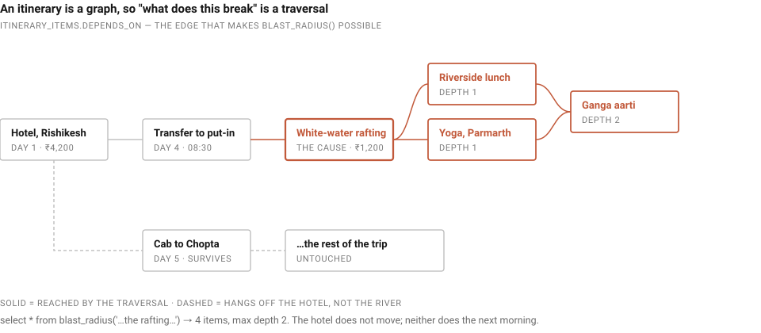
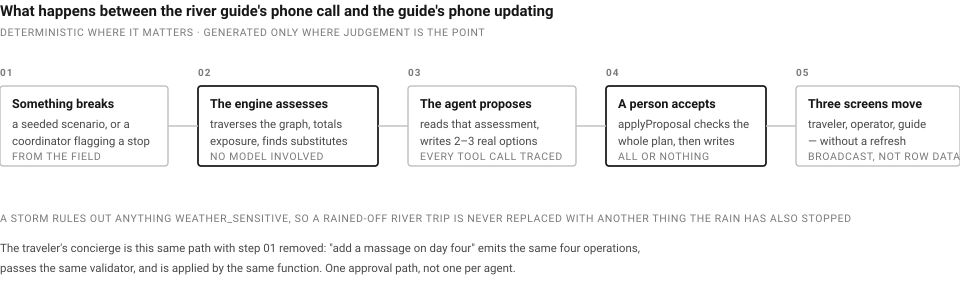
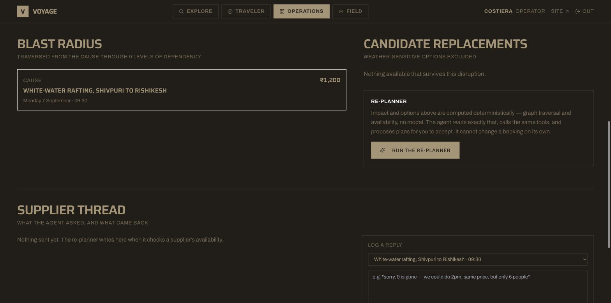
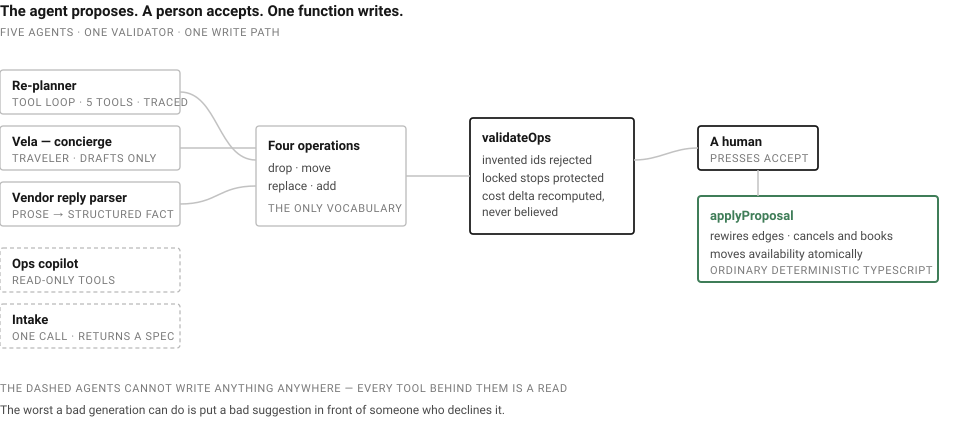
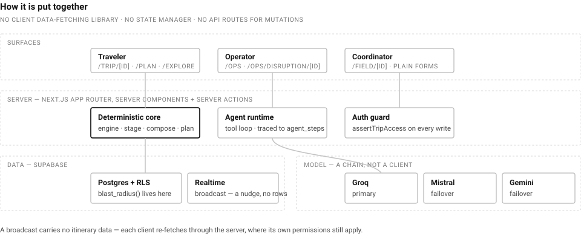
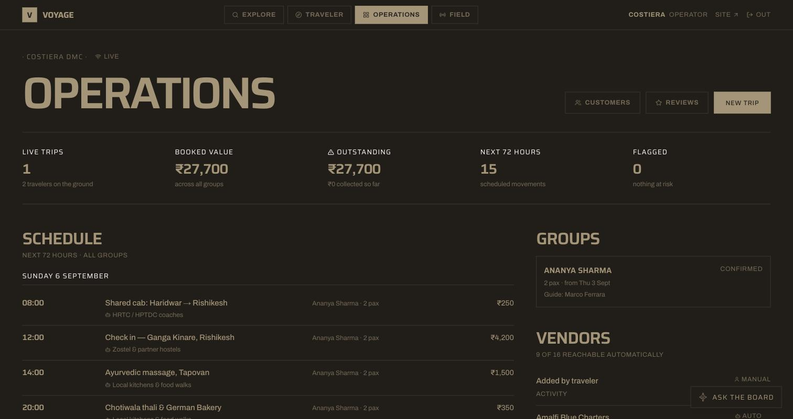
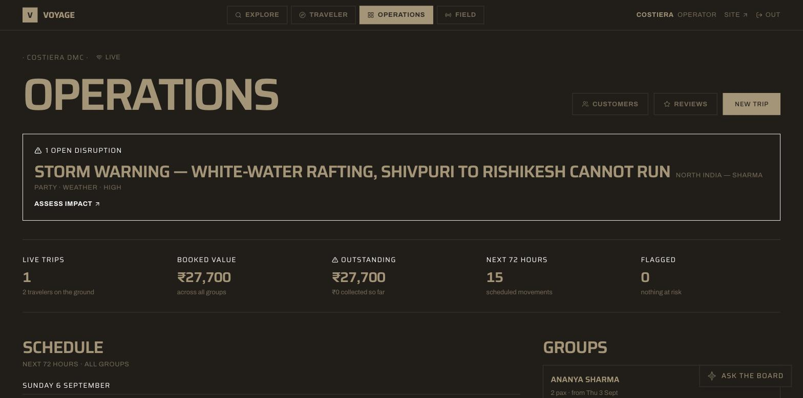
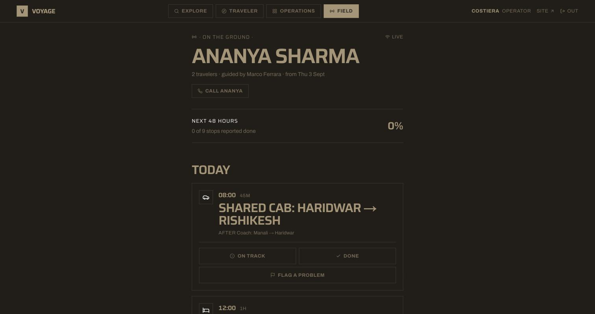
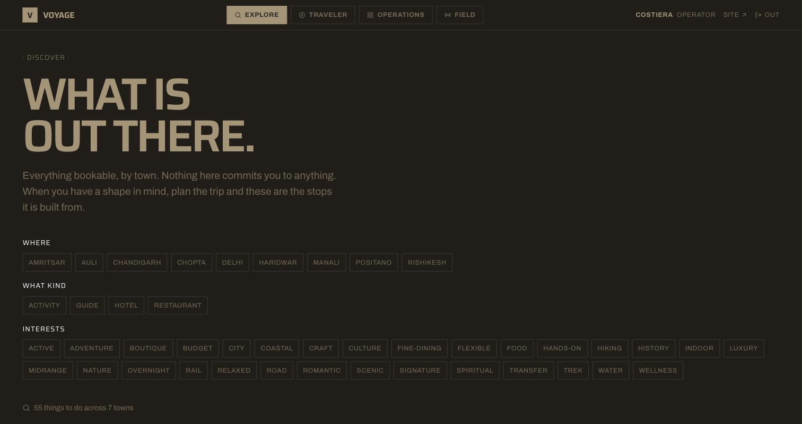

<div align="center">

# Voyage

### Personalized Dynamic Tour Planning and Tour Operations

<br/>

**An itinerary that knows what it is made of.**

Voyage models a trip as a dependency graph rather than a list, so when the river guide calls at 07:40
to say the flow is too high, the system can answer *exactly* what that costs — which stops fall with
it, which survive, what is already non-refundable — and put two or three real ways out in front of a
human being.

<br/>

### **[ Experience Voyage live → ](https://voyage-three-tawny.vercel.app/)**

<sub>↑ replace this URL after the first deploy — it appears twice in this file</sub>

<br/>


</div>

<br/>



<br/>

**Contents** ·
[The problem](#the-problem) ·
[The one decision](#the-one-decision-everything-rests-on) ·
[What is built](#what-is-actually-built) ·
[The disruption path](#the-disruption-path-end-to-end) ·
[The concierge](#the-concierge-and-why-it-is-the-same-thing) ·
[The boundary](#the-boundary-that-matters) ·
[Deterministic first](#deterministic-first-model-second) ·
[Realtime](#realtime) ·
[Honest accounting](#honest-accounting) ·
[Architecture](#how-voyage-is-built) ·
[Running it](#running-it) ·
[Checks](#checks) ·
[Inside Voyage](#inside-voyage)

---

# The Problem

A tour operator's week does not fall apart at the planning stage. Planning is the part everybody
builds software for, and it is the part that already mostly works.

It falls apart at 07:40 on the fifth morning, when the river guide calls to say the flow is too high
to put in, and three other bookings quietly depend on that raft. The lunch was booked downstream of
it. The yoga class assumed the group would be back by two. The evening aarti assumed the yoga. None
of that is written down anywhere a computer can read, so the operator reconstructs it from memory,
on the phone, while the group waits.

PS-7 asks for a platform that plans personalized tours **and operates them** — discover, personalize,
plan, price, book, prepare, operate, assist, adapt, complete, review. The adapt step is where the
money and the goodwill actually go, and it is the step that a list-shaped itinerary cannot help with
at all.

Three people see the same trip: the **traveler** who booked it, the **operator** who runs it, and the
**coordinator** standing on the ghat. When one of them changes something, the other two see it
without refreshing.

---

# The One Decision Everything Rests On

An itinerary is a **DAG, not a list**. Every stop declares what it cannot happen without, and
`itinerary_items.depends_on uuid[]` is that edge.

<p align="center">
  
</p>

This is the whole reason "identify impact" — the thing the brief actually asks for — is a graph
traversal rather than a pile of hand-written special cases:

```sql
select * from blast_radius('…the rafting…');
```

Kill the rafting and the lunch, the yoga and the aarti go with it. The hotel does not, because
nothing downstream flows backwards — and neither does the cab to Chopta the next morning, because it
hangs off the hotel rather than the river.

That is the difference between this and a list: **an afternoon of rain takes an afternoon, not the
back half of a holiday.** Blast radius, timing conflicts and cost deltas all fall out of the same
walk, and the traversal lives in Postgres so the UI and the agent cannot disagree about it.

---

# What Is Actually Built

| Surface | Route | Who it is for |
|---|---|---|
| Landing site | `/` | The pitch |
| Sign in | `/login` | Everyone — email and password, or Google |
| Explore | `/explore` | Traveler — the catalogue by town, filtered by kind, interest and place, before any trip exists |
| Planner | `/plan`, `/trip/[id]/build` | Traveler — describe the trip and get a composed itinerary, or fill the form and build from real inventory |
| Proposal | `/plan/proposal/[id]` | Traveler — the composed plan, day by day, before committing to it |
| Itinerary | `/trip/[id]` | Traveler — the plan, where it is in its life, live costs, payments, what is at risk |
| Compare | `/trip/[id]/compare/[itemId]` | Traveler — one stop against every alternative in town, with the price difference and a switch |
| Payments | `/trip/[id]/payments` | Traveler — deposits, balances and refunds as an operator recorded them |
| Print | `/trip/[id]/print` | Traveler — the itinerary as a PDF worth carrying |
| Close out & review | `/trip/[id]/review` | Traveler — mark the trip finished, then rate it stop by stop |
| Operations | `/ops` | Operator — groups, vendors, 72-hour schedule, money outstanding, open disruptions |
| Customers | `/ops/customers` | Operator — everyone travelling, grouped across trips, with lifetime value |
| Reviews | `/ops/reviews` | Operator — what came back, worst first, against the vendor who ran it |
| Impact assessment | `/ops/disruption/[id]` | Operator — blast radius, candidates, the agent, the supplier thread, the accept flow |
| Field run sheet | `/field/[id]` | Coordinator — today and tomorrow, report or escalate, on a phone |

Two of those surfaces carry a chat agent: **Vela**, the traveler's concierge, on `/trip/[id]`, and a
read-only **copilot** on `/ops`. `/plan` has a third, smaller one — describe the trip in a sentence
and the form fills itself in.

## The lifecycle, on the screen

PS-7 prints the journey it wants represented:

```
Discover → Personalize → Plan → Price → Book → Prepare
         → Operate → Assist → Adapt → Complete → Review
```

`src/lib/trip/stage.ts` is that sequence as one pure function. It takes the trip, its stops, its
bookings and its open disruptions, and returns which stage the trip is in and **the single next thing
to do about it**. `/trip/[id]` renders it as a rail across the top with that action attached.

It is there for the brief, but it was built for a worse reason. The actions in this product were
spread over five surfaces with no shared account of which one mattered *now* — confirming lived on
the build page, closing out did not exist at all, and the only way to know a draft needed confirming
was to already know. Anyone using it, including the person who wrote it, had to keep the workflow in
their head. One function that names the current stage and one obvious button is how that stops being
true, and `npm run test:lifecycle` pins every transition so the button cannot drift from the state.

Adapt outranks everything below it: an open disruption is the thing to deal with whatever else is
true of the trip, which is the whole premise of the product.

---

# The Disruption Path, End to End

<p align="center">
  
</p>

1. **A disruption is injected** — a seeded scenario from the operator's demo controls, or a
   coordinator flagging a stop from the field.
2. **The deterministic engine** (`src/lib/disruption/engine.ts`) traverses the graph, marks the blast
   radius `at_risk`, totals the exposure and the non-refundable portion, and finds substitutes that
   survive the *cause* — a storm rules out anything `weather_sensitive`, so a rained-off river trip
   is never replaced with another thing the rain has also stopped.
3. **The re-planning agent** (`src/lib/agent/replan.ts`) reads that assessment, calls the same tools,
   and writes two or three genuinely different plans.
4. **Every tool call it made is rendered in the trace panel**, with arguments, results and timings.
5. **The operator accepts one.** `applyProposal` checks the whole plan is applicable before writing
   any of it, then rewrites the itinerary deterministically: it rewires the dependency edges around
   the swap, cancels the bookings behind dropped stops and books the substitutes, returns and takes
   the matching `availability` seats, and marks the losing options superseded rather than deleting
   them.
6. **The traveler's tab and the coordinator's phone update in place.**



## The supplier thread

`check_vendor` writes the outbound approach to `messages` — "can you take the raft at 09:00 on the
14th?" — so an operator sees what the agent *did* rather than finding an unexplained booking change.

The reply half is now closed too. A vendor writes back the way vendors actually write — *"sorry, 9 is
gone, we could do 2pm, same price, but only 6 people"* — and `src/lib/agent/vendor-reply.ts` turns it
into structured fact on `messages.structured`. The extraction is not the interesting part; **the
mapping is.** "We can do 2pm not 9am" becomes a `move` op, goes through the same validator, and is
applied by the same function an operator's accepted re-plan is. A vendor gets no more authority over
the itinerary than the model does — a person presses the button either way.

---

# The Concierge, and Why It Is the Same Thing

A traveler types "add an ayurvedic massage on day four, in the afternoon" into the panel on their own
itinerary. What happens next is deliberately the disruption path with the storm taken out:

1. **Vela reads the trip.** The whole itinerary and the whole catalogue ride in her opening brief, so
   the usual request needs no lookup at all.
2. **She calls `propose_change`**, which emits the *same four operations* the re-planner emits —
   `drop`, `move`, `replace`, `add` — and they go through the *same validator*
   (`src/lib/agent/plan.ts`). Invented ids are rejected, a locked stop cannot be dropped, and the cost
   delta is recomputed rather than believed.
3. **The draft appears in the chat as a card**: what changes, what it costs, and two buttons.
4. **Accepting runs `applyProposal`** — the identical deterministic code an operator runs. The
   operator's board and the guide's phone update in place.

She cannot touch a stop the operator is already re-planning. A traveler moving a dinner that a storm
had threatened would have set it back to `confirmed` on the way through, quietly un-flagging a problem
nobody had dealt with.

---

# The Boundary That Matters

<p align="center">
  
</p>

**The agent proposes; a human accepts.** `propose_replan` and `propose_change` both write a row to
`replan_proposals`. Neither can touch a booking. The only code that changes a live itinerary is
`applyProposal`, which is ordinary deterministic TypeScript behind a button. So the worst thing a bad
generation can do is put a bad suggestion in front of someone who declines it.

That is **one approval path, not one per agent**, and it is the reason a chat box was safe to add at
all. The copilot does not even have that: every tool behind it is a read, so it has no way to write
anything anywhere.

| The system produces | A person does | Nothing happens until |
|---|---|---|
| Re-plan proposals after a disruption | Compare, then accept one | Accept |
| A concierge draft from a chat message | Read the card, accept or decline | Accept |
| A parsed vendor reply, mapped to an op | Accept the change it implies | Accept |
| A composed itinerary from a sentence | Review the proposal, then confirm | Confirm |
| A trip spec extracted from prose | Edit the form it filled in | Submit |
| Copilot answers on the ops board | Nothing — it cannot write | *n/a* |

---

# Deterministic First, Model Second

The most consequential constraint in this codebase is a rule about *when* a language model is allowed
to be involved.

```text
graph traversal      →  blast_radius(), dependency rewiring, orphan checks
       ↓                 (if this answers it, stop)
arithmetic           →  cost deltas, day allocation, budget, penalties, payments
       ↓                 (if this answers it, stop)
solver               →  breadth-first routing over the leg graph, availability, lodging tier
       ↓                 (if this answers it, stop)
language model       →  preference ordering, explanation, prose → structure
```

**Feasibility is a solver, not the model.** Availability, transit distance, cancellation penalties
and cost deltas are all computed in code before the model sees anything. The model does
preference-ordering and explains its reasoning. It is not doing the optimization, and this document
does not claim it is. The same is true in chat: the figure on a proposal card is recomputed by
`validateOps`, never the number Vela said.

Routing is the sharpest example. A model asked to order six Himalayan towns will cheerfully send you
Amritsar → Chopta → Manali, because it has no way to *feel* two days of driving. So the route is
breadth-first search over a real leg graph, day allocation is arithmetic, and every rupee is summed
from catalogue rows.

## The research pass — how a trip to somewhere unseeded exists at all

Before `src/lib/agent/research.ts`, the planner could only plan what was already in the database: ask
for Switzerland and the composer answered *"None of those places are in the catalogue yet"*, which was
true and useless.

Research is deliberately **two passes**, because the obvious one-pass design does not survive a free
tier. A web-searching model injects fetched pages into its own context before writing a word, and
travel content is enormous — *"Lucerne: 4 things to do with prices"* comes back `413
request_too_large` *after* the searching has already happened. Asking to **discover** things returns
listicles and blows the context; asking the **price of two named things** returns structured pages
and fits.

So the work splits by what each tool is actually good for:

1. **The skeleton, with no web access at all.** Which towns, in what order, what is in them, what the
   trains are, the currency and the timezone. Stable general knowledge — Zermatt has been under the
   Matterhorn for some time — answered reliably and cheaply. Nothing here needs a citation because
   nothing here is a live fact.
2. **Price verification, on the web, best-effort.** Narrow queries naming two specific things, which
   is the shape that works. Prices *are* live facts and are the thing worth checking.

Pass two is allowed to fail, in whole or in part, and the trip survives it. What changes is honesty,
not availability: a place whose price came off a real page carries `verified` and the URL it was read
from; one that did not carries the model's estimate **and says so**. A plan full of clearly-labelled
estimates is worth more than no plan, and much more than estimates presented as quotes.

Research widens what the solver can choose from. It is never allowed to decide the order of the days,
what goes on which morning, or whether it all fits.

---

# Realtime

The three surfaces stay in sync over Supabase Realtime **Broadcast**, not Postgres Changes.

Postgres Changes streams row data, so every subscriber needs a SELECT policy covering those rows —
which would mean opening `itinerary_items` wider than the schema is careful to keep it. A broadcast
carries no itinerary data at all. It is a nudge saying *"this trip moved"*; each client then re-fetches
through the server, where its own permissions still apply.

- **Server side:** `notifyTrip(tripId, event)` — one HTTP POST, never throws. A dropped notification
  degrades to "the other screens update on next navigation", which must not roll back an accepted
  re-plan.
- **Client side:** `<LiveRefresh tripIds={…} />` subscribes and calls `router.refresh()`, showing what
  arrived and when.

---

# Honest Accounting

Worth saying plainly, because the alternative is being caught.

**The composer routes; it does not reason about geography.** `/plan`'s "plan the whole trip" button
runs intake and then `src/lib/agent/compose.ts`, which is a solver rather than a generation. The leg
graph now lives in the same table as the inventory it describes (`inventory.to_city`,
`inventory.overnight`), so adding a region is an INSERT rather than a code change — but the
*geographic ordering* of the north-India corridor is still a hand-written constant, because no row
carries the fact that Haridwar is further down the country than Rishikesh. For researched trips the
equivalent hint comes from the research pass, which proposes its towns in travelling order.

**Five agents, and they are not equally impressive.** The re-planner is the real one: a tool-using
loop, depth decided at runtime, five tools, its trace persisted to `agent_steps`. The concierge and
the copilot are the same loop with different tools and a tighter iteration cap. The vendor-reply
parser is a single structured call. Intake is a single structured call and no loop at all — calling
it an agent would be generous.

**Three of them cannot write anything.** The copilot's tools are all reads. Intake returns a spec to a
form and touches no table. The concierge writes drafts only. One code path — `applyProposal` — changes
a live itinerary, and a person clicks it.

**The free tier is the likeliest thing to break a demo, and it is handled rather than hoped about.**
Groq allows 200,000 tokens a day **per organization, not per key**, so rotating a key changes nothing
and an exhausted budget 429s until a rolling window creeps open tens of minutes later.
`withRateLimitRetry` tells three cases apart: a per-minute breach it waits out, a request larger than
the ceiling it refuses immediately, and a spent daily budget it reports with the number and the
reopening time rather than sleeping pointlessly. Above that, `src/lib/agent/providers.ts` keeps a
**provider chain** — when Groq reports the daily budget spent, the runtime moves to Mistral or Gemini
and stays there for the life of the process. `npm run test:failover` proves it.

**The chat is fast until it is not.** A single request is 1–2 seconds. Groq's free tier allows 8,000
tokens a minute and an agent loop resends its history every iteration, so a burst of questions inside
one minute will hit that window and wait it out — 15 to 35 seconds, once, before returning to normal.
The chat runs on `openai/gpt-oss-20b` and the re-planner on `120b` partly for this reason: the limits
are per model, so a demo typing at the concierge cannot slow the re-plan it is about to show.

**Payments are a ledger and a state machine, not a payment processor.** `bookings.state` moves through
held → confirmed → cancelled and the penalties are real numbers the re-planner prices against. On top
of that, `payments` records what an operator says was actually received — deposits, balances, refunds
— so the trip page and the board can both show what is owed and by whom. **No card is charged anywhere
in this codebase.** The claim is that an operator can see and record the money, which is what "manage
payments" in the brief asks for; a fake checkout would have been the worse version of this. The sign
lives in `kind` rather than in the number, so a stray minus in a form cannot turn a payment into a
refund.

**Accommodation preferences reach the solver, and the catalogue had to grow to make that true.** PS-7
names them twice and there was no such field. There is now — `prefs.lodging`, matched against
`inventory.tier` when the composer picks a bed. That was only worth doing because the catalogue went
from one hotel per town to three: a preference with nothing to choose between is a form control, not a
feature. Where a town genuinely has no room in the bracket asked for — Chopta is a meadow at 2,700m
with tents and a forest hut — it books the nearest bracket and *says which town it could not match*
rather than quietly downgrading the trip. `npm run test:lodging` proves the bed, the bill and the
warning.

**Reviews are ratings, not a reputation system.** A traveler rates the trip and any stop on it; the
operator reads each rating against the vendor who ran that stop, worst first. Nothing aggregates into
a public score, nothing is shown to other travelers, and a vendor cannot reply. One rating per person
per stop, and re-rating replaces rather than stacks.

**RLS runs on the reads; the writes are still service-role, on purpose.** Every read in
`src/lib/db/queries.ts` goes through the cookie-scoped client, so the policies are what decide which
rows come back — `getTrip` takes an id and applies no ownership filter of its own. Signed in as
someone else, the demo trip's URL is a 404. `npm run test:rls` signs in as four different people and
proves it, including the case nothing else could catch: the `items_via_trip` policy carries no auth
check of its own and works only because Postgres applies `trips`' RLS to the subquery inside it. If
that assumption were wrong every itinerary would be readable by anyone with an account, and no amount
of reading the policy would tell you.

The writes still run as the service role, and that is a decision rather than a leftover:
`applyProposal` moves `availability.slots_taken` and cancels vendor bookings — catalogue rows no
user-facing policy grants a write on, and should not. So authorization for writes lives one layer up,
in `src/lib/auth/guard.ts`: every mutating server action calls `assertTripAccess`, which asks RLS the
same question the read path asks. **A new mutating action that forgets it is a hole, and there is no
second line of defence beneath it.** That is the remaining soft spot, and it is a convention rather
than a mechanism.

**Inventory is reserved, not brokered.** Confirming a trip or accepting a re-plan creates real
`bookings` rows and moves `availability.slots_taken` atomically, so a seat taken by one group is gone
for the next. What it does not do is talk to a vendor system — an `auto` vendor's booking is marked
confirmed on the strength of nothing but the schema saying they are reachable.

**Weather is seeded.** `OPENWEATHER_API_KEY` is optional and unused by the demo path on purpose: a
live API that flakes on stage is a liability.

**The catalogue holds two regions at once, deliberately.** `supabase/seed.sql` is the original Amalfi
catalogue and `supabase/seed-india.sql` layers north India *alongside* it rather than replacing it,
because the disruption demo and every re-planner test assert against fixed Amalfi UUIDs. The visible
cost is a vendor list that mixes Positano with Rishikesh, and a house operator still named Costiera
DMC. `scripts/purge-to-amalfi.sql` reduces the database to one region when that matters.

---

# How Voyage Is Built

<p align="center">
  
</p>

Next.js 14 App Router with server components and server actions, over Supabase for Postgres, auth,
RLS and realtime. **No client-side data fetching library, no state manager, and no API routes for
mutations** — server actions do the write and revalidate the readers in one step. The field surface in
particular is plain forms posting to server actions, which is a deliberate choice for the screen most
likely to be used one-handed on a cliff path with two bars of signal.

A few decisions worth naming:

**The blast radius lives in Postgres.** `blast_radius()` is a SQL function, not TypeScript, so the UI,
the engine and the agent's tools all get the same answer to the same question. Two implementations of
a graph walk is two chances to disagree about what a storm costs.

**Availability moves atomically.** `adjust_availability()` is a database function, so a seat taken by
one group cannot be handed to another by a race between two accepted re-plans.

**The application has its own clock.** `demo_base_date()` and `now()` pin what day the product thinks
it is, so the seed, the run sheet, the lifecycle rail and Vela all agree. This was not cosmetic: with
the demo day pinned a day behind the machine's, the storm scenario scanned a shorter list of stops and
picked a free evening aarti with no dependants and no deposit — the flagship assessment arriving empty,
intermittently, depending on the time of day the button was pressed.

**Every model call has a deterministic fallback or an honest failure.** No feature in this product is
unreachable when a key is missing or a budget is spent; what degrades is polish, not function.

<details>
<summary><b>Repository layout</b></summary>

```text
src/
├── app/
│   ├── plan/  trip/[id]/  trip/[id]/build/    traveler (+ the concierge panel)
│   ├── explore/                               the catalogue, before a trip exists
│   ├── ops/   ops/disruption/[id]/            operator
│   ├── field/ field/[id]/                     coordinator
│   ├── login/ auth/callback/                  sign in, and where OAuth lands
│   └── privacy/ terms/ security/ api-docs/    the boring necessary pages
├── components/                                39 components across 10 areas
├── lib/
│   ├── auth/        who is looking at this page, and what they may act on
│   ├── db/          queries (RLS), mutations (service role), row types
│   ├── disruption/  the deterministic engine and the demo scenarios
│   ├── agent/       the loop, the shared plan validator, and the five agents
│   ├── trip/        the eleven-stage lifecycle, as one pure function
│   ├── realtime/    the broadcast contract and the server-side sender
│   └── supabase/    admin (service role), server (RLS), browser clients
└── middleware.ts    session refresh + the route guard

supabase/
├── migrations/      14 migrations · 17 tables · RLS on every one · 22 policies
├── seed.sql         the Amalfi catalogue and the demo group
├── seed-india.sql   the north India catalogue, layered alongside
└── verify.sql       invariants — run after every migration

scripts/             db setup, type generation, and 23 test suites
docs/                the build spec, the demo path, and these diagrams
```

</details>

---

# Technology

| Layer | Technology | Role |
|---|---|---|
| Framework | Next.js 14 App Router, React 18 | Server components, server actions, no mutation API routes |
| Language | TypeScript 5.7, Zod 4 | Typed rows end to end; schemas at every model boundary |
| Styling | Tailwind CSS 3.4 | Monochrome-first design system |
| Motion | GSAP, Lenis | Landing-site motion only |
| Database | Supabase Postgres | `blast_radius()`, `adjust_availability()`, `demo_base_date()` |
| Authorization | Postgres RLS + `assertTripAccess` | Policies decide reads; a guard decides writes |
| Identity | Supabase Auth | Email/password, optional Google OAuth |
| Realtime | Supabase Realtime **Broadcast** | A nudge per trip, carrying no row data |
| Language model | Groq `gpt-oss-120b` / `20b` | Preference ordering, explanation, prose → structure |
| Failover | Mistral, Gemini | Provider chain when the daily budget is spent |
| Hosting | Vercel · Supabase | App · data platform |

No message broker, no vector database, no second datastore, and no LLM framework.

---

# Running It

### 1. Environment

```bash
cp .env.example .env.local
```

Fill in, from your Supabase project's **Settings → API** and **Settings → Database**:

| Variable | Where from |
|---|---|
| `NEXT_PUBLIC_SUPABASE_URL` | Settings → API |
| `NEXT_PUBLIC_SUPABASE_ANON_KEY` | Settings → API |
| `SUPABASE_SERVICE_ROLE_KEY` | Settings → API — server-side only, bypasses RLS |
| `SUPABASE_DB_PASSWORD` | Settings → Database |
| `GROQ_API_KEY` | console.groq.com — free tier, no card |

`GROQ_MODEL` and `GROQ_CHAT_MODEL` are optional overrides; see `.env.example` for why they are two
settings and not one.

`MISTRAL_API_KEY` and `GEMINI_API_KEY` are optional but worth setting before a demo — they are the
provider chain described above.

**Google sign-in** needs two things set up outside this repo, and it is inert until both are done:

1. Google Cloud console → *APIs & Services → Credentials → OAuth client ID* (Web application). The
   authorized redirect URI must be exactly
   `https://YOUR-PROJECT-REF.supabase.co/auth/v1/callback` — Supabase's, not this app's.
2. Supabase → *Authentication → Providers → Google* → enable it and paste in that client ID and
   secret. Then, under *Authentication → URL Configuration*, add `http://localhost:3000` and the
   deployed origin to **Redirect URLs**, or the callback is refused.

Until then, set `NEXT_PUBLIC_GOOGLE_AUTH=off` to hide the button: Supabase rejects an unconfigured
provider at its own `/authorize` endpoint, so the user lands on raw JSON that this app never gets the
chance to intercept. Email and password work with no setup at all.

`AUTH_ENFORCED=false` turns the route guard off while leaving session refresh alone — the switch to
reach for if sign-in breaks shortly before a demo.

### 2. Database

```bash
npm install
npm run db:setup     # migrations, seed, and verification in one pass
npm run db:types     # regenerate row types from the live schema
```

`db:seed` runs `scripts/seed-auth.mjs` after the SQL, which creates the demo accounts and points the
seeded trip at them. **That step is not optional:** `trips_read` matches on `traveler_id = auth.uid()`
and the SQL seeds that column null, so without it the demo trip is invisible to everybody once RLS is
doing the filtering.

| Sign in as | Email | Sees |
|---|---|---|
| Traveler | `ananya@example.com` | Her own itinerary, and Vela |
| Operator | `ops@costiera-dmc.example` | The board, every group and vendor |
| Coordinator | `marco@costiera-dmc.example` | The run sheet for her group |

All of them use `voyage-demo-2026` (override with `DEMO_PASSWORD`). They are recreated on every
re-seed, so a password changed in the dashboard is undone rather than remembered.

The seed computes every date from `current_date`, so the trip is always in progress on whatever day
you run it.

> **If a script says `ENOTFOUND db.<ref>.supabase.co`.** That host publishes only an AAAA record, so
> on a network with no IPv6 route — a lot of conference wifi — it cannot be reached and every
> `pg`-based script dies looking exactly like a deleted project. It is not.
> `SUPABASE_POOLER_HOST` in `.env.local` takes the pooler hostname from Supabase → Settings →
> Database → Connection string (`aws-0-<region>.pooler.supabase.com`); the pooler is dual-stack and
> every script prefers it when set, assembling the user and password from what is already configured
> so a password rotation has one place to change. `scripts/db-setup.mjs` checks for the AAAA record
> and tells you which of the two problems you are looking at.

> **If the host does not resolve at all.** A free-tier Supabase project pauses after a week idle and
> is deleted after ninety days, at which point its hostname stops resolving and every command fails
> with `ENOTFOUND`. Create a fresh project, put the new URL, keys and database password in
> `.env.local`, and run `npm run db:setup` again — the schema and the whole demo group are rebuilt
> from the files in `supabase/`. **Nothing about the demo lives only in the database.**

`db:setup` records applied migrations in `supabase_migrations.schema_migrations` — the same ledger the
Supabase CLI uses — so it and `supabase db push` agree about what has run. It is safe to re-run;
already-applied migrations are skipped.

### 3. Develop

```bash
npm run dev          # http://localhost:3000/app
```

> **Do not run `npm run build` while `npm run dev` is running.** They share the `.next` directory, and
> the production build overwrites the dev server's chunks — the symptom is every route suddenly 404ing
> with `MODULE_NOT_FOUND` in the terminal. Stop the dev server, or `rm -rf .next` and restart it.

### A note on the display font

`public/fonts/` is empty by design. The display face is KTF Metro Blueline, which is not
redistributable here — see `public/fonts/README.md` for where to get it. Until the files exist the
site falls back to Saira, which is metrically similar, and nothing else needs changing.

---

# Checks

```bash
npm run test:all         # everything below except the agent, in order, leaving a clean database

npm run db:verify        # schema and seed invariants — every row should say PASS
npm run test:rls         # four people sign in; nobody sees anyone else's trip
npm run test:disruption  # the deterministic engine, against the live database
npm run test:field       # the coordinator run sheet, reporting and escalation
npm run test:apply       # the write path — a plan that cannot fully apply must not half-apply
npm run test:lodging     # accommodation preferences: the bed, the bill, and the town it could not match
npm run test:compare     # comparing alternatives and switching to one, ledger and graph included
npm run test:lifecycle   # the eleven stages, payments arithmetic, closing out and reviewing
npm run test:flow        # the whole product end to end on a trip built from scratch
npm run test:realtime    # a browser-key subscriber receives what the server broadcasts
npm run test:screens     # the screens render, and the button you are meant to press is on them
npm run test:replan-tools # the re-planner's five tools, without the model — costs no tokens
```

These cost real model calls, and the re-planner takes anywhere from 55 to 240 seconds on Groq's free
tier. Run them deliberately:

```bash
npm run test:agent         # a full re-planner run, including its trace
npm run test:concierge     # the traveler's concierge, through to an accepted change
npm run test:copilot       # the operator's copilot, including that it refuses to write
npm run test:intake        # prose to a trip spec, including inventing nothing
npm run test:research      # the two-pass research agent
npm run test:abroad        # composing a trip to a country nobody seeded
npm run test:failover      # the provider chain, when the daily budget is spent
npm run test:vendor-reply  # a vendor's prose reply, parsed and mapped to an op
```

`db:verify` is the one to run after any migration or re-seed. The plan's ordering was deliberate — the
blast radius has to be provably correct *before* an agent reasons over it, or a wrong re-plan could
mean a bad graph or a bad model and you end up debugging both at once.

`test:flow` is the one that catches seams. Every other suite exercises one layer against the seeded
group; this one plans a trip from nothing, confirms it, books it, breaks it, re-plans it, accepts,
checks the guide's run sheet, and deletes itself — including giving back every seat it took. A layer
can pass alone and still fail here.

`test:screens` is the suite this project did not have, and its absence is why every bug in the last
stretch — stale verified prices, duplicate landmarks, a budget in the wrong currency, a missing link
to the confirm step — was found by clicking rather than by a test. All four would have passed
everything else, because the logic under them was right and the screen was not.

`test:concierge` caught the bug this feature was most likely to ship with: an added stop with no
declared prerequisites is an orphan in the graph, so nothing upstream reaches it and every later blast
radius is quietly smaller. The manual planner had always chained a new stop to whatever preceded it;
the agent path had not, which means the re-planner had the same hole. `applyProposal` now chains
through the same helper `addItem` uses, and `verify.sql` asserts no itinerary has two roots.

---

# Inside Voyage

<table>
<tr>
<td width="50%"><br/><sub><b>The public product page</b></sub></td>
<td width="50%"><br/><sub><b>The traveler's itinerary</b> — the eleven-stage rail, live costs, what is locked in</sub></td>
</tr>
<tr>
<td width="50%"><br/><sub><b>Operations</b> — every group, vendor and movement in the next 72 hours</sub></td>
<td width="50%"><br/><sub><b>An open disruption</b> — outranks everything else on the board</sub></td>
</tr>
<tr>
<td width="50%"><br/><sub><b>Impact assessment</b> — blast radius, surviving candidates, the supplier thread</sub></td>
<td width="50%"><br/><sub><b>The field run sheet</b> — today and tomorrow, on a phone, one-handed</sub></td>
</tr>
<tr>
<td width="50%"><br/><sub><b>Explore</b> — the catalogue by town and interest, before any trip exists</sub></td>
<td width="50%"></td>
</tr>
</table>

---

# What Changes With Voyage

| Without it | With Voyage |
|---|---|
| "What else does this affect?" is answered from memory, on the phone | A graph traversal, in Postgres, in milliseconds |
| A rained-off morning is re-planned by cancelling the afternoon too | The blast radius is exactly the stops that actually depend on it |
| The replacement is another thing the same storm has stopped | Substitutes must survive the *cause*, not just be free |
| The traveler finds out when the guide tells them | Their tab updates in place, as the operator accepts |
| An AI that books things you did not agree to | The agent proposes; one function writes; a person presses it |
| A model asked whether an itinerary fits | A solver computes it, and the model explains it |
| A price the model said | A price recomputed from catalogue rows before it is shown |
| "It works on my machine, on Tuesday" | An application clock the seed, the run sheet and the agent all share |

---

# Documentation

| File | What it is |
|---|---|
| [`docs/DEMO.md`](docs/DEMO.md) | The three-minute path through the product |
| [`docs/plan.md`](docs/plan.md) | Phase 1 — the landing page |
| [`docs/plan-phase2.md`](docs/plan-phase2.md) | The build spec this implements |
| [`docs/build-execution.md`](docs/build-execution.md) | How it was actually built, in order |
| [`docs/techstack.md`](docs/techstack.md) | Stack decisions and the reasoning behind them |
| [`docs/NEXT.md`](docs/NEXT.md) | What is not done |

---

<div align="center">

Voyage is built on one idea: **an itinerary should know what it is made of,
so that a person can be told what breaking one piece actually costs.**

<br/>

### **[ Experience Voyage live → ](https://REPLACE-ME.vercel.app)**

<br/>

<sub>Built for HackCelestia · Problem Statement 7 — Personalized Dynamic Tour Planning and Tour Operations</sub>

</div>
